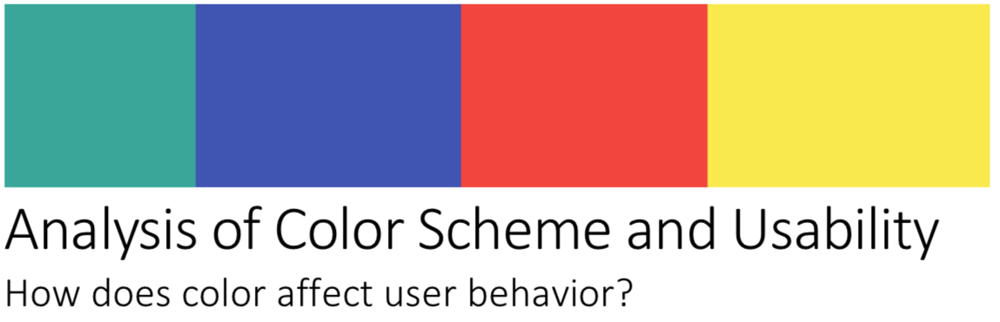
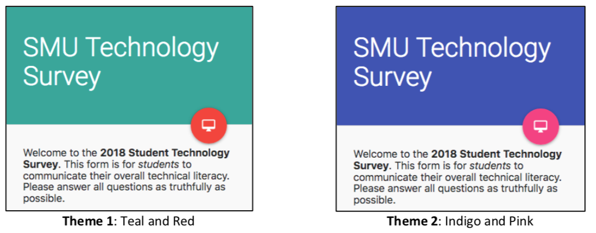
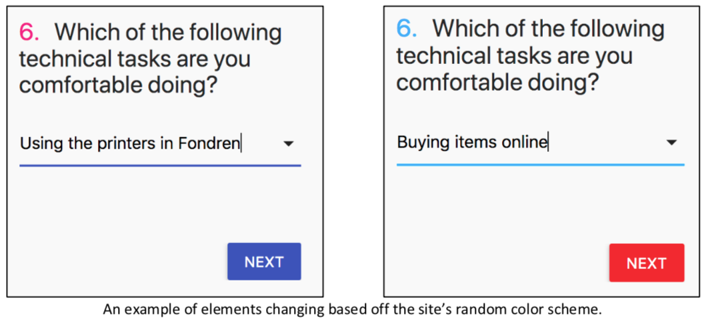
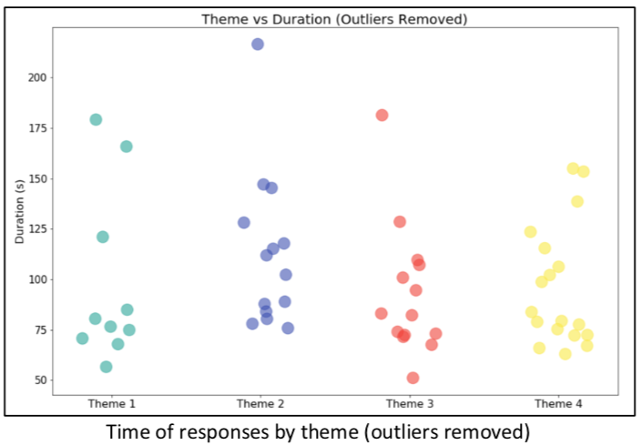

# A/B Testing Form for CSE 8316

A live version of this site can be found (until May) at [SMUTechSurvey.com](http://smutechsurvey.com).

In this project, I attempted to collect and analyze usability data based off one independent variable: color scheme. I implemented a custom website that utilizes A/B testing to collect data on users. 

The site, a simple user survey, collected usability information like success rate, time to completion, and overall user satisfaction. Variation came from changing the primary and accent colors of the website for different users. I then analyzed the resulting data in order to better predict how color scheme influences user behavior.

The data analysis can be found at [Data Analysis/Survey Data Analysis.ipynb](./Data%20Analysis/Survey%20Data%20Analysis.ipynb)

The full report can be read [here](Project%20Report.pdf). Please read it as it took me forever to write.
